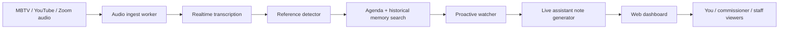

# CMB Live Assistant Architecture

The assistant is built as a live meeting room with three cooperating layers:

1. Live capture
   - Input can come from the MBTV/YouTube live stream, Zoom audio, a room microphone, or a staff-provided audio feed.
   - The MVP accepts transcript segments over HTTP and includes a demo stream.
   - The production version should run a server-side audio pipeline so private keys and retrieval logic stay off viewer devices.

2. Meeting intelligence
   - Realtime transcription produces partial and final transcript segments.
   - A reference detector extracts agenda item codes, ordinances, resolutions, LTCs, contracts, speaker names, departments, and policy topics.
   - Retrieval searches current agenda materials first, then historical meeting memory.
   - A proactive watcher compares live claims with prior structured records.
   - The assistant emits live notes, priority alerts, source cards, unresolved questions, and possible follow-ups.

3. Shared access
   - The web dashboard broadcasts live transcript, notes, and source cards to every connected viewer.
   - In production, put the app behind authentication and give each user a role: admin, commissioner, staff, or observer.
   - Notes should distinguish confirmed source-backed facts from model-generated interpretations.

## Production Data Flow

## Retrieval Priority

1. Current meeting agenda packet and supplements.
2. Item-specific attachments, memoranda, ordinances, and resolutions.
3. Prior Commission meetings since 2023.
4. Committee and land-use board materials when cross-referenced.
5. Public web search only when the meeting references outside material.

## Guardrails

- Show citations and source links for every factual claim.
- Label uncertain matches as "possible reference."
- Keep a verbatim transcript log separate from summaries.
- Do not silently change public record wording.
- Add a manual correction path so staff can pin the correct agenda item during the meeting.
